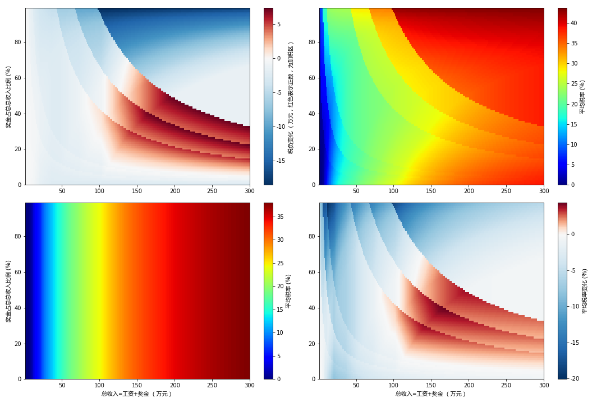

   万众期待的个税改革草案昨天被发布出来征求公众意见，目前似乎讨论都只集中在起征点和级距上。然而，相比于另一个重大变化，也许起征点提高那么一点点的利得对于相当一部分人来说会被完全抵消。这个重大变化就是——年终奖要和工资合并计税了，从此以后年终奖的税是大大提高了的。。

为了仔细分析这一点的影响，先来看下目前的年终奖扣税规定：

以下内容引用自《国家税务总局关于调整个人取得全年一次性奖金等计算征收个人所得税方法问题的通知》（国税发〔2005〕9号）：

<blockquote>
<dl><dt>二、纳税人取得全年一次性奖金，单独作为一个月工资、薪金所得计算纳税，并按以下计税办法，由扣缴义务人发放时代扣代缴：</dt><dd><dl><dt>(一) 先将雇员当月内取得的全年一次性奖金，除以12个月，按其商数确定适用税率和速算扣除数。</dt><dd>如果在发放年终一次性奖金的当月，雇员当月工资薪金所得低于税法规定的费用扣除额，应将全年一次性奖金减除“雇员当月工资薪金所得与费用扣除额的差额”后的余额，按上述办法确定全年一次性奖金的适用税率和速算扣除数。</dd>
<dt>(二) 将雇员个人当月内取得的全年一次性奖金，按本条第(一)项确定的适用税率和速算扣除数计算征税，计算公式如下：</dt><dd><ul><li>如果雇员当月工资薪金所得高于(或等于)税法规定的费用扣除额的，适用公式为：
应纳税额＝雇员当月取得全年一次性奖金×适用税率一速算扣除数</li><li>如果雇员当月工资薪金所得低于税法规定的费用扣除额的，适用公式为：
	应纳税额＝(雇员当月取得全年一次性奖金一雇员当月工资薪金所得与费用扣除额的差额)×适用税率一速算扣除数</li></dd></dd></dl>
</blockquote>

因此目前年终奖税率和基本工资是基本没有关系的。而草案税制实施后，由于所有收入要“综合计税”并按年扣缴，所以年终奖的最低税率将变成基本工资的边际税率。
<blockquote>
    “（一）居民个人的综合所得，以每一纳税年度的收入额减除费用六万元以及专项扣除、专项附加扣除和依法确定的其他扣除后的余额，为应纳税所得额。专项扣除包括居民个人按照国家规定的范围和标准缴纳的基本养老保险、基本医疗保险、失业保险等社会保险费和住房公积金等；专项附加扣除包括子女教育、继续教育、大病医疗、住房贷款利息和住房租金等支出。
</blockquote>

因此，尽管草案税制起征点略有提高，并且级距稍有扩大，但其实对大多数中产的减税作用并没有想象得那么大，部分人甚至会被加税。

笔者试算了从年总收入1万到300万区间内草案税制的影响，结果如下图所示：

图中左上为草案税制与现行税制需缴纳税款的差额；右上和左下分别为现行税制和草案税制下平均税负，即个税/总收入；右下为平均税负的变化。

试算基于如下假设：
- 按帝都规定正常缴纳五险一金，帝都平均工资取最新公布8467元/月。正常情况下这个数字即将用于2018年7月到2019年6月社保基数计算。
- 只在一个单位取得工资奖金收入，没有其他需要“综合计税”的收入。
- 旧税率：
  月标准扣除额3500元
  
全月应纳税所得额（含税级距） | 税率 | 速算扣除数 
------ | -- | --- |
不超过1,500元 | 3% |0 |
超过1,500元至4,500元的部分 | 10% | 105
超过4,500元至9,000元的部分 |	20% | 555
超过9,000元至35,000元的部分 | 25% | 1,005
超过35,000元至55,000元的部分 | 30% | 2,755
超过55,000元至80,000元的部分 | 35% | 5,505
超过80,000元的部分 | 45% | 13,505 

- 草案税率：
  年标准扣除额60000元

| 全年应纳税所得额（含税级距） | 税率 | 速算扣除数 |
| - | - | - |
|不超过36,000元 | 3% |0 |
|超过36,000元至144,000元的部分 | 10% |2,520|
|超过144,000元至300,000元的部分 |	20% |16,920|
|超过300,000元至420,000元的部分| 25% |31,920|
|超过420,000元至660,000元的部分| 30% |52,920|
|超过660,000元至960,000元的部分| 35% |85,920|
|超过960,000元的部分 | 45% |181,920 |

可以看出，如果按照草案执行，收入在90-200万元，奖金占总收入比例在20%-60%（也就是年终奖为3-18个月月薪）的相对高收入中产是最不幸的，不但没有获得减税，反而被加了税，最高可能要多缴纳总收入4-5%的税。考虑到收入在250万以上的人群年终奖占比都会比较高，所以大部分真正高收入的人群，比如年薪几千万的某保险公司老总这种反而能获得一小点减税（至少不会被加税，虽然他们也不会在意这么几万元钱）。当然，一直宣传的给低收入群体减税也算是实现了吧。
