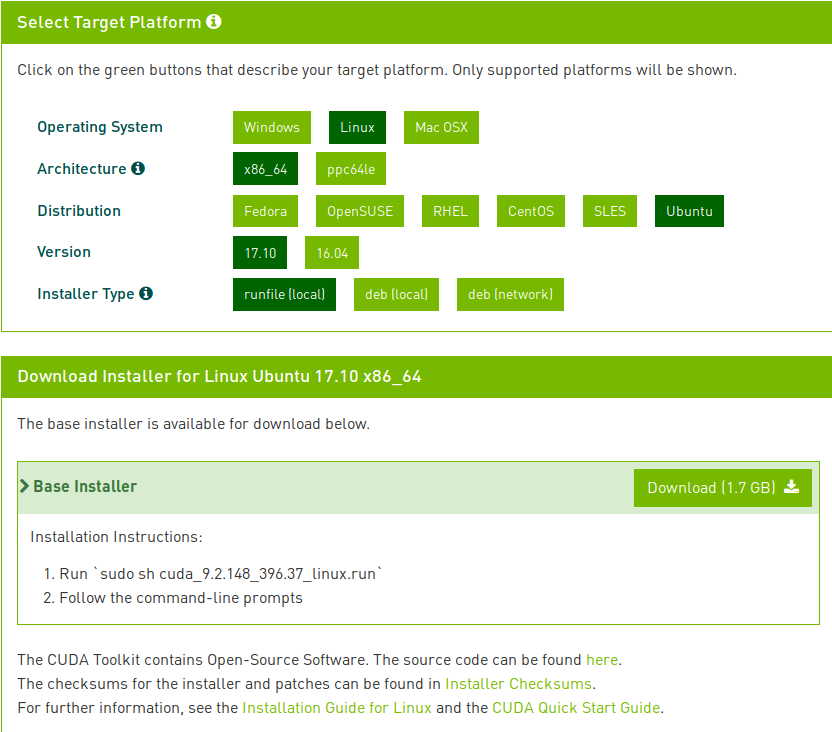

### CUDA
系统升级到了Mint 19需要重新安装配置Cuda，同时升级到Cuda 9.2。Cuda 9.2需要Nvidia的驱动版本至少是396.37，但不幸的是apt仓库里的396版本驱动有问题，安装后无法被内核加载从而导致系统运行在软解状态。因此只好用bin文件安装。步骤如下：

1. 去官网下载Cuda 9.2的bin安装文件，注意里面自带驱动所以不需要单独安装驱动。


2. 按`Ctrl+Alt+F2`进入命令行模式，登录并`sudo -i`切换到root用户。
3. 将之前安装的Nvidia驱动卸载掉以避免冲突。
```bash
apt purge nvidia-396 nvidia-modprobe nvidia-settings
apt autoremove
```

4. 停止X桌面服务。
```bash
/etc/init.d/lightdm stop
```

5. 给下载的run文件加执行权限，并运行
```bash
chmod a+x cuda_9.2.148_396.37_linux.run
./cuda_9.2.148_396.37_linux.run
```
按提示操作。问yes/no的问题都选yes。

6. 安装完成后重启。

7. 将cuda加入系统路径中：
在`/etc/profile`文件中加入如下内容
```
export PATH=/usr/local/cuda/bin:$PAT
```


8. 安装cuda示例所需依赖。
```bash
sudo apt install libgl-dev libglu-dev libx11-dev libegl1-mesa-dev libgles2-mesa-dev libmpich-dev
```

9. 将cuda示例的所有者从root改为当前用户(默认情况示例会被自动安装在sudo用户的`$HOME`下)。
```bash
chown -R booksword:booksword NVIDIA_CUDA-9.2_Samples/
```

10. 编译示例。
```bash
# force input macro value as linux mint is not officially supported
GLPATH="/usr/lib/x86_64-linux-gnu" GLLINK="-L/usr/lib/x86_64-linux-gnu" DFLT_PATH="/usr/lib" EGLLIB="/usr/lib/x86_64-linux-gnu" GLESLIB="/usr/lib/x86_64-linux-gnu" make -j6
```

### cuDNN
首先从[官网](https://developer.nvidia.com/rdp/cudnn-download)下载cudnn的deb文件:
- cuDNN v7.1.4 Runtime Library for Ubuntu16.04 (Deb)
- cuDNN v7.1.4 Developer Library for Ubuntu16.04 (Deb)
- cuDNN v7.1.4 Code Samples and User Guide for Ubuntu16.04 (Deb)

然后安装
```bash
dpkg -i libcudnn7_7.1.4.18-1+cuda9.2_amd64.deb
dpkg -i libcudnn7-dev_7.1.4.18-1+cuda9.2_amd64.deb
dpkg -i libcudnn7-doc_7.1.4.18-1+cuda9.2_amd64.deb
```
安装完成后编译运行官方测试用例以验证安装：
将`/usr/src/cudnn_samples_v7/`复制到有写权限的目录下，并编译
```bash
cd cudnn_samples_v7/mnistCUDNN/
make
```

### NCCL
```bash
dpkg -i nccl-repo-ubuntu1604-2.2.13-ga-cuda9.2_1-1_amd64.deb
```

#### 参考资料
> 官网文档
