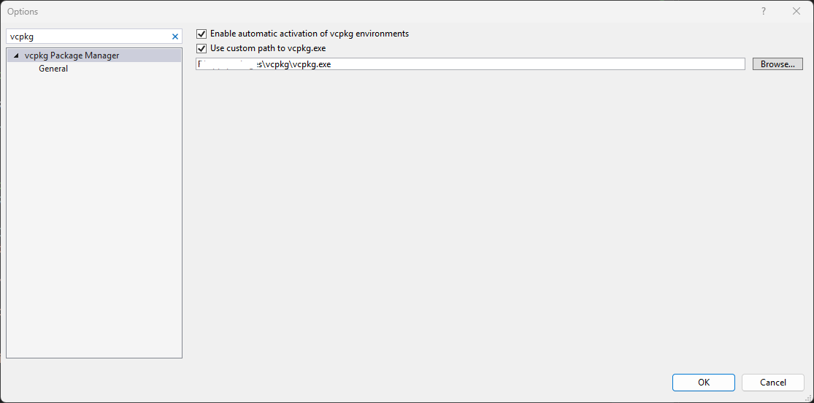

记录下笔者vcpkg配置以及和CMake联动方法。

### 获取
在适当的地方克隆一个vcpkg仓库，并初始化
```bash
git clone git@github.com:microsoft/vcpkg.git
.\bootstrap-vcpkg.bat # Windows or
./bootstrap-vcpkg.sh  # *inx-like
```
这会下载vcpkg.exe，如果被GFW阻拦，可以自己下载然后放到对应目录。

### Visual Studio相关
如果安装了Visual Studio，那么要确定没有安装vcpkg，否则需要使用Visual Studio Installer移除vcpkg模块。原因是Visual Studio自带vcpkg禁用了classic模式，并且和克隆的会造成冲突。
移除后，指定Visual Studio使用克隆的vcpkg.exe：
菜单`Tools->Options`，查找vcpkg，在“Use custom path to vcpkg.exe”里设为克隆的vcpkg.exe。



### 环境变量
- 新增`VCPKG_ROOT`环境变量指向克隆根目录。
- 并修改`Path`，在里面新增一项`%VCPKG_ROOT%`。

### 安装包
```
vcpkg install libzmq
```
这会将libzmq安装到`%VCPKG_ROOT%\installed`里面

### 整合到CMake
在项目的`CMakeList.txt`的最前面（一定要在`project()`前面）加上
```cmake
# Check if VCPKG_ROOT environment variable exists
if(DEFINED ENV{VCPKG_ROOT})
    file(TO_CMAKE_PATH "$ENV{VCPKG_ROOT}" VCPKG_ROOT)
    # Check if the path exists
    if(EXISTS "${VCPKG_ROOT}")
        # Add VCPKG_ROOT to the find_package path
        set(CMAKE_TOOLCHAIN_FILE "${VCPKG_ROOT}/scripts/buildsystems/vcpkg.cmake")
        message(STATUS "Set CMAKE_TOOLCHAIN_FILE to VCPKG_ROOT: ${CMAKE_TOOLCHAIN_FILE}")
    else()
        message(WARNING "VCPKG_ROOT path does not exist: ${VCPKG_ROOT}")
    endif()
endif()
```

这会判断`VCPKG_ROOT`环境变量是否定义了，定义了的话获取对应的路径并将`CMAKE_TOOLCHAIN_FILE`指向`%VCPKG_ROOT%\scripts\buildsystems\vcpkg.cmake`，这样所有vcpkg安装的包都可以被`find_package`找到了。

## 参考资料
> - Deepseek回答